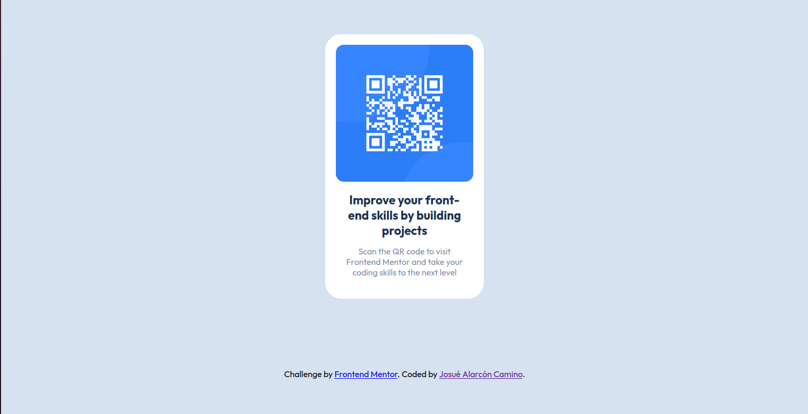

# Frontend Mentor - QR code component solution

This is a solution to the [QR code component challenge on Frontend Mentor](https://www.frontendmentor.io/challenges/qr-code-component-iux_sIO_H). Frontend Mentor challenges help you improve your coding skills by building realistic projects. 

## Table of contents

- [Overview](#overview)
  - [Screenshot](#screenshot)
  - [Links](#links)
- [My process](#my-process)
  - [Built with](#built-with)

- [Author](#author)

**Note: Delete this note and update the table of contents based on what sections you keep.**

## Overview

### Screenshot

### Links

- Solution URL: [GitHub](https://github.com/jaac97/challenges-frontend-mentor)
- Live Site URL: [Netlify](https://dashing-chebakia-66a74e.netlify.app/)

## My process

### Built with

- Semantic HTML5 markup
- CSS custom properties
- Flexbox
- Mobile-first workflow

## Author

- LinkedIn - [Josué Alarcón](https://www.linkedin.com/in/josue-alarcon-camino/)
- Github - [@jaac97](https://github.com/jaac97)
- Frontend Mentor - [@jaac97](https://www.frontendmentor.io/profile/jaac97)

