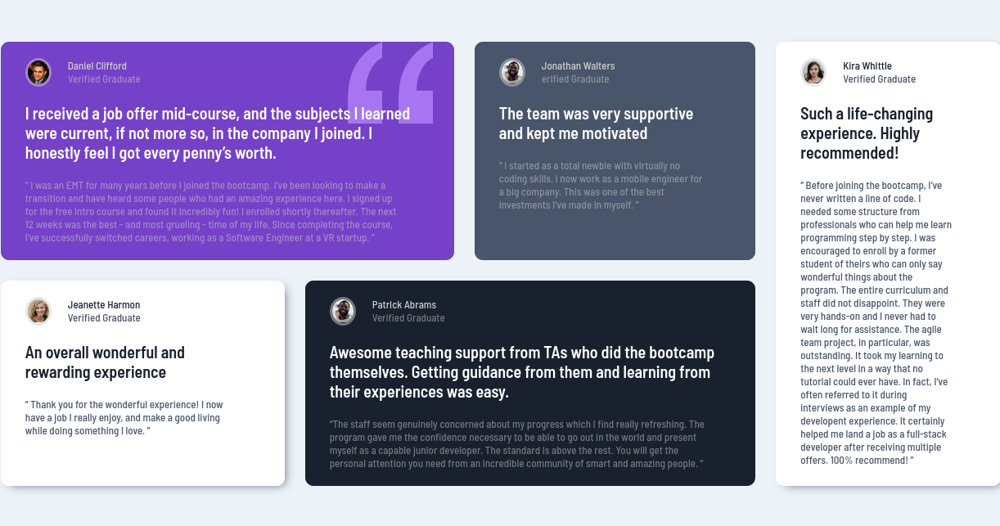

# Frontend Mentor - Testimonials grid section solution

This is a solution to the [Testimonials grid section challenge on Frontend Mentor](https://www.frontendmentor.io/challenges/testimonials-grid-section-Nnw6J7Un7). Frontend Mentor challenges help you improve your coding skills by building realistic projects. 

## Table of contents

- [Overview](#overview)
  - [The challenge](#the-challenge)
  - [Screenshot](#screenshot)
  - [Links](#links)
- [My process](#my-process)
  - [Built with](#built-with)
- [Author](#author)

**Note: Delete this note and update the table of contents based on what sections you keep.**

## Overview

### The challenge

Users should be able to:

- View the optimal layout for the site depending on their device's screen size

### Screenshot

### Links

- Solution URL: [Testimonials cards GitHub repository](https://github.com/jaac97/challenges-frontend-mentor/tree/main/testimonials-grid-section-main)
- Live Site URL: [Testimonials cards on Netlify](https://6255e2c6df4f281fae93e8d0--mellow-tarsier-c515b4.netlify.app/)

## My process

### Built with

- Semantic HTML5 markup
- CSS custom properties
- Flexbox
- CSS Grid
- Mobile-first workflow
- CSS BEM Methodology

## Author
- LinkedIn - [Josué Alarcón](https://www.linkedin.com/in/josue-alarcon-camino/)
- Github - [@jaac97](https://github.com/jaac97)
- Frontend Mentor - [@jaac97](https://www.frontendmentor.io/profile/jaac97)

